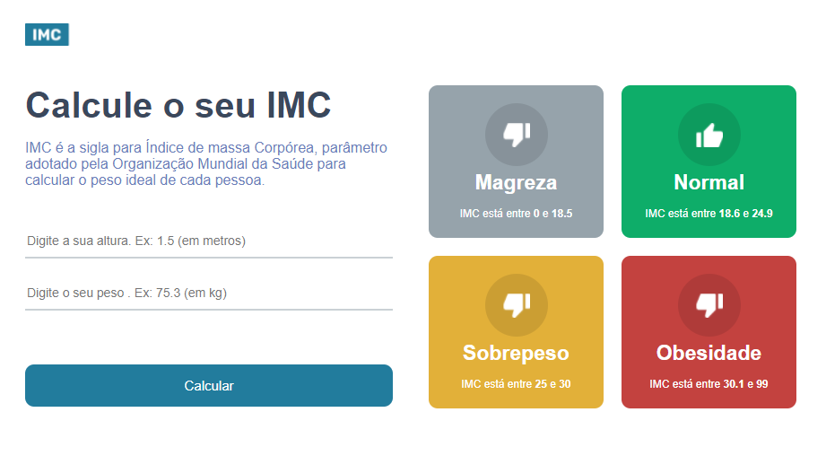
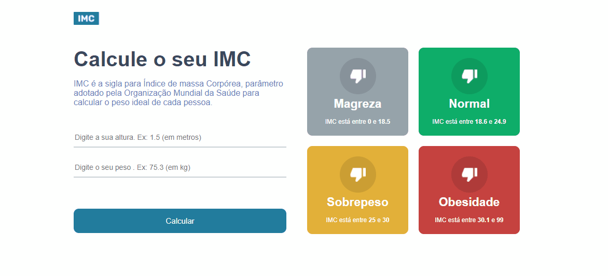

# Calculadora de IMC 🧮

- ### Link do projeto: [Projeto criando uma calculadora de IMC.](https://react-calc-imc-beta.vercel.app/)
 

<h1 align="center">
    
</h1>

### 🛠️ Tecnologias

As seguintes ferramentas foram usadas na construção do projeto:

-[TypeScript](https://www.typescriptlang.org/)

-[React](https://pt-br.reactjs.org/)

-[Styled-components](https://styled-components.com/)

<h1 align="center">
    
</h1>
### Instalação

- `npm install`

### Para rodar
- `npm start`
